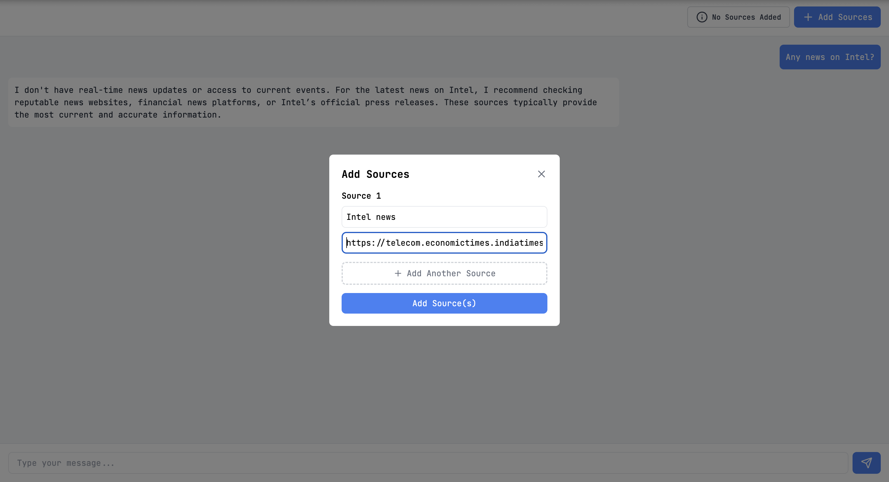

# RAG Chat

## Frontend
- React + Vite 
- Zustand
- Lucide icons and TailwindCSS

## Backend
- FastAPI
- Langchain
- uv

## Flow

Add sources as links using the CTA on the top right

Once the page is crawled, the model can be prompted to answer questions about the context:

## Todo

- [ ] Source addition:
    - [ ] File upload handling
    - [x] Accept multiple links 

- [ ] Chat interface:
    - [x] State handling
    - [ ] Polish UI

- [ ] Refactor slop

- [ ] Perf: Streaming, indexedDB, code snippet handling 

- [ ] Accept OAI key as auth

- [ ] CI/CD - Render and Vercel